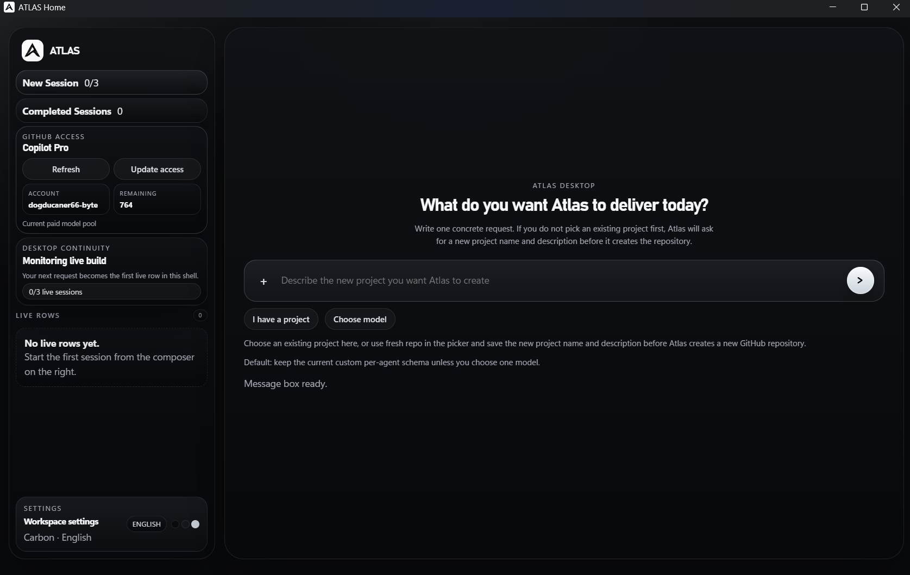
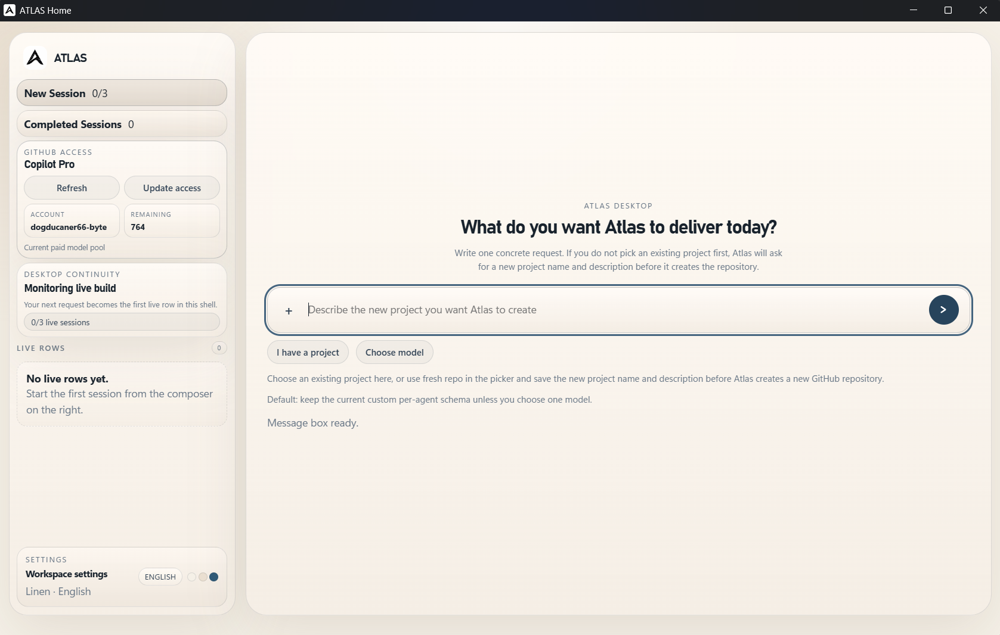
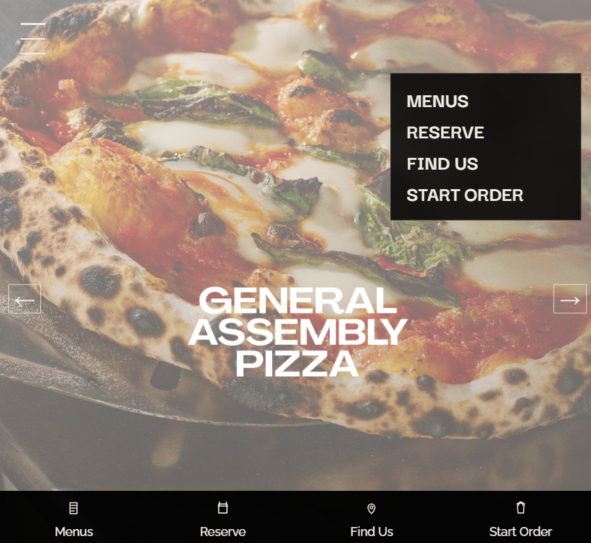

# ATLAS

ATLAS is a desktop app that lets you describe a software product in plain language and then turns that request into a working delivery flow. Instead of manually setting up a repo, picking tools, writing every first draft, and coordinating each implementation step yourself, you open ATLAS, describe what you want, and let the system plan and build it for you.

## What It Does

ATLAS is built for people who want to go from an idea to a usable product with less setup friction.

- You describe one concrete request.
- ATLAS creates or selects the project context.
- The system plans the work, runs the build flow, and tracks progress.
- You monitor the session from the desktop interface instead of stitching everything together by hand.

## How To Use It

1. Launch the desktop app with `ATLAS.cmd start` or `npm run atlas:open`.
2. Start a new session from the home screen.
3. Type a direct request for the product you want ATLAS to deliver.
4. If you already have a project, attach it from the picker. If not, ATLAS will ask for the new project name and description before it creates the repository.
5. Watch the live build row and completed sessions area as the system works through the request.

### Dark Desktop View

	

### Light Desktop View

	

## Example Delivery

One example request was to create a site experience inspired by the General Assembly Pizza style. ATLAS took that prompt and produced a working restaurant landing page with a bold hero image, simple primary navigation, and mobile-first action links for menus, reservations, location, and ordering.

	

This is the core promise of ATLAS: you ask for a concrete outcome, and the system turns that request into a real build artifact you can inspect, refine, and ship.

## Development Status

ATLAS is currently under active development.

This implies the following:

- Architectural boundaries and worker behaviors remain subject to controlled evolution.
- Selected decision mechanisms are recalibrated at regular intervals.
- The system is explicitly designed to increase capability, reliability, and safety on a per-cycle basis.

In practical terms, this repository should be viewed less as a finalized product showcase
and more as a continuously operating R&D environment.

## How ATLAS Works Internally

Behind the desktop UI, ATLAS runs as a governed multi-agent delivery system. Different roles handle planning, execution, review, observability, and iterative improvement so the product request can move through a controlled build cycle instead of a one-shot script.

## The Agent Roster

### Leadership Layer

**Jesus** — CEO Supervisor  
Maintains strategic direction and adjudicates high-impact prioritization decisions.
Interprets cycle state, constrains escalation growth, and enforces directional coherence
to prevent strategic drift across autonomous cycles.

**Prometheus** — Evolution Architect  
Performs deep repository analysis to identify self-improvement opportunities and
produces a structured, dependency-aware execution plan. Balances advancement pressure
against implementation feasibility and consolidation requirements.

**Athena** — Reviewer  
Executes adversarial review of plans and implementations, validates assumptions,
and functions as a quality and governance gate prior to major progression events.

---

### Research Layer

**Research Scout** — Knowledge Hunter  
Conducts structured open-internet reconnaissance for high-value technical knowledge,
emerging patterns, and implementation-relevant practices for autonomous agent systems.
Returns raw research artifacts for downstream synthesis.

**Research Synthesizer** — Knowledge Organizer  
Transforms Scout artifacts into topic-organized, decision-ready synthesis outputs.
Reduces informational noise, preserves high-signal findings, and supplies planning
layers with higher-quality strategic inputs.

---

### Worker Layer

**Evolution Worker** — Codebase Improver  
Focuses on runtime evolution, refactoring, and structural capability improvements
across core system components.

**quality-worker** — Test Specialist  
Owns verification depth, behavioral validation, and regression prevention.
Treats passing checks as a baseline control, not as final evidence of adequacy.

**governance-worker** — Policy Enforcer  
Enforces policy conformance, state governance, and auditability requirements.
Maintains traceable decision lineage and record integrity as a discipline backbone.

**infrastructure-worker** — Foundation Layer  
Handles orchestration plumbing, deployment pathways, containerized runtime
infrastructure, and operational continuity mechanics.

**integration-worker** — Connector  
Coordinates inter-component compatibility and validates communication reliability
across subsystem boundaries.

**observation-worker** — Signal Collector  
Collects telemetry, health indicators, and runtime signals, then performs anomaly
detection and early warning escalation when pattern behavior deviates.

---

## ATLAS Mindset

ATLAS is ambitious not because it is static or flawless, but because it is capable
of institutional learning under iterative constraints.
Its objective is not one-shot perfection; its objective is progressive gains in
robustness, intelligence, and autonomy across successive operational cycles.

## ATLAS Desktop Shell

ATLAS now launches inside a native Electron window instead of opening a localhost page in the default browser. The desktop shell keeps the root workspace route authoritative, stores a session-bound workspace brief under `state\atlas\desktop_sessions\`, and reopens the same live workspace window instead of presenting a separate startup product mode. Repeat launches reuse the same desktop instance, restore the existing window, and keep the last session, workspace draft, and window bounds beside the packaged app.

Use `ATLAS.cmd start` or `npm run atlas:open` to launch the desktop shell, `npm run atlas:desktop:build` to transpile the Electron entrypoints, and `ATLAS.cmd package` or `npm run atlas:desktop:package` to emit a portable Windows app folder with the root executable at `dist\ATLAS\ATLAS.exe`.

	

